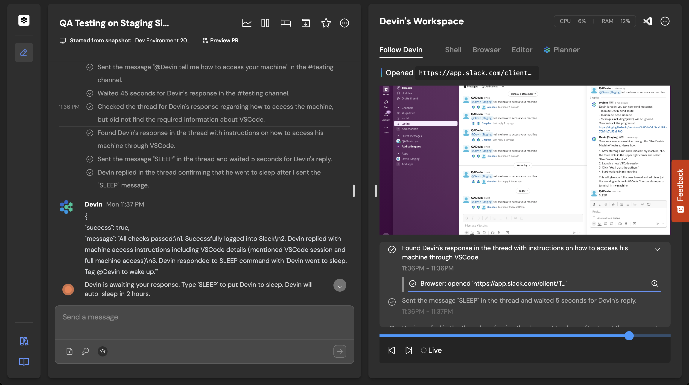

================================================================================
コマンドラインからDevinを呼び出してみないか？
================================================================================

:Event: AI駆動開発勉強会 【Devin Meetup Japan #2】
:Presented: 2025/06/17 nikkie

.. （デモでたたいておく？）

お前、誰よ？（**Python使い** の自己紹介）
================================================================================

* nikkie（にっきー）
* `ブログ <https://nikkie-ftnext.hatenablog.com/>`__ 連続 940日突破
* @ftnext 私が欲しい小さなライブラリをおすそ分け感覚でOSS

Devin歴
---------------------------------------------------

* 自腹で月$500数回（後述）
* Devin飯（`入門 DevinでUber Eats注文 <https://nikkie-ftnext.hatenablog.com/entry/devin-order-uber-eats-101>`__）
* Devin Open Source Initiative、メンテナしてる `SpeechRecognition <https://github.com/Uberi/speech_recognition>`__ に補助ありがとう

Devinには **API** がある
================================================================================

* `Devin API <https://docs.devin.ai/api-reference/overview>`__
* **Teamプラン** （$500/month）以上（`Pricing <https://devin.ai/pricing>`__）

DevinはDevinをテストする
---------------------------------------------------

* CognitionのDevin APIの使い方：`Devin 101: Automatic PR Reviews with the Devin API <https://cognition.ai/blog/devin-101-automatic-pr-reviews-with-the-devin-api>`__
* https://github.com/CognitionAI/qa-devin （画像引用元）

.. qa-devinのスクリーンショット
    https://github.com/CognitionAI/qa-devin/blob/86b769b0dcf14b18e4685b3e3248d29bc289fc51/README.md?plain=1#L4-L9

    ### Devin uses its browser to open app.devin.ai and test its functionality.
    

    ### Devin opens a Slack page and starts a new devin session with @Devin
    

.. revealjs-break::
    :notitle:

.. image:: ../_static/aid-devin2/qa-devin-open-devin-and-test.png

.. revealjs-break::
    :notitle:

コマンドラインからDevinを呼び出してみないか？ 完
---------------------------------------------------

.. code-block:: bash

    curl --url https://api.devin.ai/v1/sessions \
      --header 'Authorization: Bearer <token>' \
      --header 'Content-Type: application/json' \
      --data '{
      "prompt": "Review the pull request at https://github.com/example/repo/pull/123",
      "idempotent": true
    }'

https://docs.devin.ai/api-reference/sessions/create-a-new-devin-session

完ではなく、今回のこだわりポイント
================================================================================

* コマンドラインからDevin APIをただ叩くのではなく
* *simonw/llmのプラグイン* として

Simon Willison
---------------------------------------------------

* DjangoのCo-creatorにして（勝手に） *我がヨーダ*
* プロンプトインジェクションのブログ（`Prompt injection and jailbreaking are not the same thing <https://simonwillison.net/2024/Mar/5/prompt-injection-jailbreaking/>`__）読んだ方🙋
* `Andrej Karpathyとなかよしさん <https://x.com/karpathy/status/1933582359347278246>`__ に見える

simonw/llm
---------------------------------------------------

* https://pypi.org/project/llm/

.. code-block:: bash

    # OPENAI_API_KEY
    uvx llm "Ten fun names for a pet pelican"

.. uvx llm models

プラグインでサポートするモデルを拡張
---------------------------------------------------

.. code-block:: bash

    uvx --with llm-gemini \
      llm -m gemini-2.0-flash 'Tell me fun facts about Mountain View'

simonw/llmの推しポイント
---------------------------------------------------

* Unixコマンドと **パイプ** で繋げられる！
* 自動ロギング（拙ブログ `simonwさんのllmは天才！ LLM APIへの入出力が全部ロギングされてました <https://nikkie-ftnext.hatenablog.com/entry/2025/04/11/224643>`__）

プラグインは誰でも開発できる！
---------------------------------------------------

* cookiecutterテンプレート https://github.com/simonw/llm-plugin から始める
* 拙ブログ `simonw/llmのプラグイン作成 素振りの記：GeminiにYouTubeのURLを渡して要約／文字起こしするプラグインをGistで配布 <https://nikkie-ftnext.hatenablog.com/entry/simonw-llm-plugin-practice-youtube-url-support-gemini>`__

llm-devin
================================================================================

* https://pypi.org/project/llm-devin/

.. code-block:: bash

    uvx --with llm-devin \
      llm -m devin "Hello, Devin"

アイデア実現するも
---------------------------------------------------

* コマンドラインから叩けたが、私はそこまで熱狂しなかった（次の興味へ）
* 別に **ブラウザで見たい** かも（ブラウザで見られる情報、いろいろ便利）

もう1つ：DeepWiki、超便利🫶
================================================================================

* https://deepwiki.com/
* もともとソースコードリーディング好き。**自然言語でコードベースに質問** できるのが、革命

.. https://docs.devin.ai/work-with-devin/deepwiki

**MCPサーバ** があるのを知ってますか？
---------------------------------------------------

.. raw:: html

    <blockquote class="twitter-tweet" data-lang="ja" data-align="center" data-dnt="true">
The DeepWiki MCP server is live!  How to use it + what’s inside 🧵👇 <a href="https://t.co/U5xKYvJ7iE">pic.twitter.com/U5xKYvJ7iE</a>
&mdash; Cognition (@cognition_labs) <a href="https://twitter.com/cognition_labs/status/1925616232570450426?ref_src=twsrc%5Etfw">2025年5月22日</a></blockquote> 

DeepWiki MCP 3つのツール
---------------------------------------------------

* read_wiki_structure
* read_wiki_contents
* ask_question

ドキュメント https://docs.devin.ai/work-with-devin/deepwiki-mcp

持論：MCPサーバはもちろん **人間が使って** もいい！
================================================================================

DeepWikiをブラウザを開く代わりに **コマンドラインでask_question**

こちらもプラグインとして実装
---------------------------------------------------

.. code-block:: bash

    uvx --with llm-devin \
      llm -m deepwiki -o repository simonw/llm \
      "llmの主要な機能を教えて"

.. デモ

:command:`llm -m deepwiki` 自画自賛ポイント
---------------------------------------------------

* ブラウザを開かずにコードベースに質問できて、私には超便利
* simonw/llmの自動ロギングにより、**DeepWikiのページを思い出せる**

まとめ🌯コマンドラインからDevinを呼び出してみないか？
================================================================================

* DevinにはAPIがある
* DeepWikiにはMCPサーバがある
* **simonw/llmプラグイン** として呼び出せるようにした

ご清聴ありがとうございました
--------------------------------------------------

Enjoy llm-devin!

https://github.com/ftnext/llm-devin
