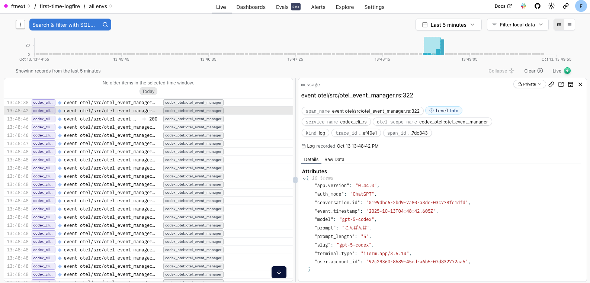

======================================================================
ねぇ、Codex CLI。私だけにあなたのコンテキスト、教えて？
======================================================================

デモ準備メモ
======================================================================

* VS Codeでcodex-rs、rust-v0.42.0タグ + ローカルの変更を開く
* VS Codeのターミナルで :file:`.env` 読み込み
* ブラウザは https://logfire-us.pydantic.dev/ftnext/first-time-logfire

.. VS Codeコマンドカンペ (codex-rs/ 下で)
    PS1='%# '
    source .env 

ねぇ、Codex CLI。私だけにあなたのコンテキスト、教えて？
======================================================================

:Event: Codex Meetup Japan #1
:Presented: 2025/10/14 nikkie

お前、誰よ？（**Python使い** の自己紹介）
======================================================================

* nikkie（にっきー）
* 機械学習エンジニア・LLM・自然言語処理（`We're hiring! <https://hrmos.co/pages/uzabase/jobs/1829077236709650481>`__）
* `Speeda AI Agent <https://www.uzabase.com/jp/info/20250901/>`__ 開発

.. image:: ../_static/uzabase-white-logo.png

.. _サム・アルトマン: https://publishing.newspicks.com/books/9784910063447

宣伝：書籍『`サム・アルトマン`_』、いかがですか？
------------------------------------------------------------

.. image:: ../_static/sama-book.jpg
    :width: 80%

持論：コーディングエージェントは **全て** 分かりたい
======================================================================

*ねぇ、Codex CLI。私だけにあなたのコンテキスト、教えて？*

.. _codex-rs: https://github.com/openai/codex/tree/main/codex-rs

Codexは **Rust** 実装（`codex-rs`_）
------------------------------------------------------------

    リリース１ヶ月後にはTypeScriptからRustにスクラッチで書き直され

laisoさん `新Codex CLIの使い方 <https://blog.lai.so/codex-rs-intro/>`__

.. _#2103: https://github.com/openai/codex/pull/2103

.. _v0.44.0: https://github.com/openai/codex/releases/tag/rust-v0.44.0

`v0.44.0`_ で **OpenTelemetry** [#otel]_ の実装が入った
------------------------------------------------------------

    `#2103`_ OpenTelemetry events

.. [#otel] OpenTelemetryは、可観測性（システムの出力から内部状態を理解する能力）を得る手段

OpenTelemetry events (`#2103`_ v0.44.0)
======================================================================

.. code-block:: toml
    :caption: デフォルト設定（:file:`~/.codex/config.toml`）

    [otel]
    environment = "staging"
    exporter = "none"
    log_user_prompt = false

``otel.exporter`` を指定して起動
------------------------------------------------------------

.. code-block:: bash

    codex -c 'otel.log_user_prompt=true' \
      -c "otel.exporter={otlp-http={endpoint=\"https://logfire-us.pydantic.dev/v1/logs\",headers={Authorization=\"Bearer $LOGFIRE_TOKEN\"},protocol=\"json\"}}"

今回は *Logfire* で観測します
------------------------------------------------------------

脱線：他のツールでも
------------------------------------------------------------

* Claude Code（コンソールへ）
* Gemini CLI：システムプロンプトまで簡単に見えます（ファイルへ）

Codex CLIのコンテキスト、もっと見たい！
======================================================================

システムプロンプトなど、 **どんなコンテキストエンジニアリングをしているか** を見たい、分かりたい

Using OpenAI Codex & Pydantic Logfire to Debug Rust Code
----------------------------------------------------------------------

.. raw:: html

    <iframe width="560" height="315" src="https://www.youtube-nocookie.com/embed/hr6pFn46pKk?si=7XzOcKTj2wMiwnEI" title="YouTube video player" frameborder="0" allow="accelerometer; autoplay; clipboard-write; encrypted-media; gyroscope; picture-in-picture; web-share" referrerpolicy="strict-origin-when-cross-origin" allowfullscreen></iframe>

.. revealjs-break::

* Pydantic社による配信のアーカイブ
* **Logfire** という可観測性サービス。Rust向けのSDKも提供
* codex-rsにLogfire Rust SDKを組み込んで、Codexの挙動を観測

Codex CLIは手元でビルドできる！
------------------------------------------------------------

* v0.44.0 の前の v0.42.0 (`rust-v0.42.0 <https://github.com/openai/codex/tree/rust-v0.42.0/codex-rs>`__)
* :command:`cargo run --bin codex`
* v0.44.0 で入ったOpenTelemetryの実装とLogfireを一緒に動かせてないです

デモ：手元でビルド〜Logfireに記録
------------------------------------------------------------

.. image:: ../_static/aidd-codex1/codex-rs-logfire1.png

.. revealjs-break::

.. image:: ../_static/aidd-codex1/codex-rs-logfire2.png

まとめ🌯：ねぇ、Codex CLI。私だけにあなたのコンテキスト、教えて？
======================================================================

* 持論：コーディングエージェントは全て分かりたい
* :command:`codex -c` でOpenTelemetryのexporterを指定できる
* Logfire Rust SDKを組み込む動画に沿ってローカルでビルドし、コンテキストを覗いてみた

One more thing: Codex CLIにコードを読ませて進めた
------------------------------------------------------------

* 試しにcodexに質問したら、Logfire SDKのソースコードまで読みに行っていた
* そこからはガンガン読ませていった（ただv0.44.0で動かすまではいけてません）
* 1回で数万トークン使うので、Proゆえの富豪アプローチかも（Pulseを体験したくて）

ご清聴ありがとうございました
------------------------------------------------------------
