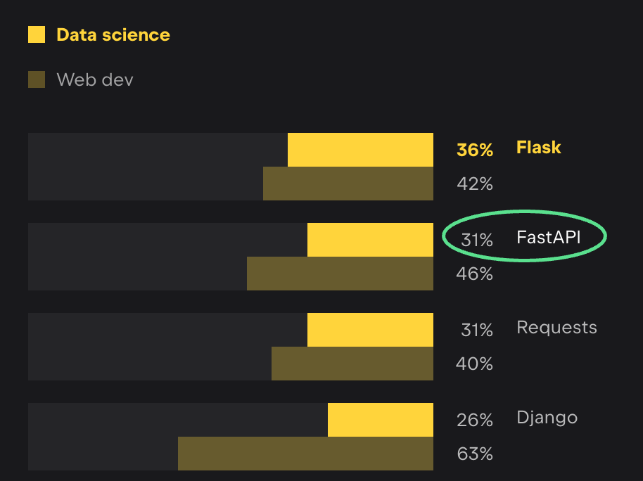

:ogp_title: FastAPIの現場から
:ogp_event_name: djangocongressjp
:ogp_slide_name: practical-fastapi
:ogp_description: DjangoCongress JP 2025
:ogp_image_name: djangocongressjp

======================================================================
**FastAPI** の現場から
======================================================================

:Event: DjangoCongress JP 2025
:Presented: 2025/02/22🐈 nikkie

お前、誰よ
======================================================================

* nikkie（にっきー） ※本発表は個人の見解です
* **機械学習** エンジニア
* プロダクトとして価値を届けるために **Web APIの開発も** します（今回FastAPIの知見を共有）

.. image:: ../_static/uzabase-white-logo.png

.. revealjs-break::

* `ブログ <https://nikkie-ftnext.hatenablog.com/>`__ 連続 **820** 日突破
* :fab:`github` `@ftnext <https://github.com/ftnext>`__ このスライドで使ってる `ftnext/sphinx-new-tab-link <https://github.com/ftnext/sphinx-new-tab-link>`__ など
* 2023年に悪いことしました `Djangoアプリに作り込んで学ぶ脆弱性 <https://ftnext.github.io/2023-slides/djangocongressjp/learn-vulnerabilities.html>`__

FastAPI、ご存知ですか？
======================================================================

* 聞いたことがある🙋‍♂️
* 使ったことがある🙋‍♀️

トーク14本中FastAPIが登場しそうなのは他に1本

PythonコミュニティにおけるFastAPI
--------------------------------------------------

`Python Developers Survey 2023 <https://lp.jetbrains.com/python-developers-survey-2023/#frameworks-and-libraries>`__ より

Webフレームワーク 第3位
--------------------------------------------------

.. image:: ../_static/djangocongressjp/survey-2023-web-framewarks.drawio.png

.. 注目
    * Flask 33%
    * Django 33%
    * **FastAPI 29%**
    * Django REST Framework 18%

**データサイエンス** で使われる
--------------------------------------------------

.. 注目
    * Flask 36%
    * **FastAPI 31%**
    * Django 26%

FastAPI
======================================================================

.. literalinclude:: ../../samplecode/fastapi/first_steps_app.py
    :language: python
    :lines: 3-10
    :caption: Tutorialの `First Steps <https://fastapi.tiangolo.com/tutorial/first-steps/>`__

Djangoの :file:`urls.py` のところの話

path ``/`` に GET ``operation`` が来たら
--------------------------------------------------

.. literalinclude:: ../../samplecode/fastapi/first_steps_app.py
    :language: python
    :lines: 3-10
    :emphasize-lines: 6

``root`` 関数を実行してレスポンスを返す
--------------------------------------------------

.. literalinclude:: ../../samplecode/fastapi/first_steps_app.py
    :language: python
    :lines: 3-10
    :emphasize-lines: 7-8

この延長に機械学習モデルをサーブするAPI

.. 単語としてResNetが登場 https://fastapi.tiangolo.com/tutorial/path-params/

他方 Django REST Framework
--------------------------------------------------

.. code-block:: txt
    :caption: `Quickstart <https://www.django-rest-framework.org/tutorial/quickstart/>`__ にある **認証付きAPI**

    bash: curl -u admin -H 'Accept: application/json; indent=4' http://127.0.0.1:8000/users/
    Enter host password for user 'admin':
    {
        "count": 1,
        "next": null,
        "previous": null,
        "results": [
            {
                "url": "http://127.0.0.1:8000/users/1/",
                "username": "admin",
                "email": "admin@example.com",
                "groups": []
            }
        ]
    }

.. _Django vs. FastAPI, An Honest Comparison: https://www.david-dahan.com/blog/comparing-fastapi-and-django

記事 `Django vs. FastAPI, An Honest Comparison`_
------------------------------------------------------------

* Batteries includedか、 **自分で組み合わせる** 必要があるか
* 非同期対応の度合い（部分的か、fullyか）
* IMO：それぞれ得意分野が異なる

FastAPIの現場から
======================================================================

.. 技術や組織の前提を最初に紹介しておく

* 社内向けの **小さなWeb API** をチームで開発（認証機能はなし）
* FastAPIのチュートリアルを皆で参照しながら
* 見聞きしていたPyConのトークも手がかりに（👉今回の知見共有。熟知はしてないです）

手がかり（個々に取り上げます）🏃‍♂️
--------------------------------------------------

* 記事 `FastAPI+SQLAlchemyで非同期WebAPI <https://www.rhoboro.com/2021/06/12/async-fastapi-sqlalchemy.html>`__
* `PyCon JP 2021: Python x DDD!! <https://2021.pycon.jp/time-table?id=272415>`__
* `PyCon JP 2024: SQLModel入門 <https://2024.pycon.jp/ja/talk/MXKU77>`__

外部のLLMの **API** を使うアプリケーション
--------------------------------------------------

.. code-block:: python
    :caption: `ChatGPTを非同期でPythonから利用する方法 <https://blog.hirokiky.org/entry/2023/03/14/163203>`__ (2023時点)

    class GPTView(View):
        async def post(request):
            res = await openai.ChatCompletion.acreate({...})

* **非同期IO** が有効。皆やってみたさがあり、FastAPIを選択

小さい単位で **都度設計** しながら進めています
--------------------------------------------------

* 最初に全機能設計したわけではありません
* **path 1つ、operation 1つ** に絞って（既存を拡張するよう）設計し、実装
* これを繰り返す。 **その時点の最適解** を更新していく

XP（eXtreme Programming）🏃‍♂️
--------------------------------------------------

* アジャイル開発の1手法
* 小さい価値でも届け、そこからの学びを活かす **サイクル** を何度も何度も回す（今回のAPIは3ヶ月経過）
* 対象の *ドメイン* や使っている技術の理解が少しずつ増えていく

開発の流れ
--------------------------------------------------

* 開発単位：ユーザストーリー
* 完了条件となる受け入れテストを書く（**ATDD**）
* 既存実装を拡張する設計を考え、テスト駆動開発（&ペアプログラミング）で実装

同僚による🏃‍♂️
--------------------------------------------------

.. raw:: html

    <iframe class="speakerdeck-iframe" style="border: 0px; background: rgba(0, 0, 0, 0.1) padding-box; margin: 0px; padding: 0px; border-radius: 6px; box-shadow: rgba(0, 0, 0, 0.2) 0px 5px 40px; width: 100%; height: auto; aspect-ratio: 560 / 315;" frameborder="0" src="https://speakerdeck.com/player/f4d5c3d15476469591749e0597f4fd36?slide=16" title="受け入れテスト駆動開発で不確実性に段階的に対処する/Addressing Uncertainty Incrementally with Acceptance Test-Driven-Development" allowfullscreen="true" data-ratio="1.7777777777777777"></iframe>

デプロイ先は **Kubernetes**
--------------------------------------------------

* マイクロサービスなAPI群
* 今回のFastAPIアプリもコンテナ化
* GKEにデプロイ

私が暗黙の前提にしてるかも

サンプルアプリケーション
--------------------------------------------------

* 書籍アプリ
* `iktakahiro/dddpy <https://github.com/iktakahiro/dddpy>`__ の一部を再実装（一覧と作成のみ）
* https://github.com/ftnext/fastapi-playground/tree/djangocongressjp-2025-v1/book-app/api

お品書き：FastAPIの現場から
--------------------------------------------------

1. **非同期IO**
2. クリーンなアーキテクチャを志向する
3. Twelve-Factor App

非同期IO
======================================================================

* FastAPI
* SQLModel (SQLAlchemy)

.. include:: asynchronous-io/fastapi.rst.txt

.. include:: asynchronous-io/sqlmodel.rst.txt

お品書き：FastAPIの現場から
======================================================================

1. 非同期IO
2. **クリーンなアーキテクチャを志向する**
3. Twelve-Factor App

.. include:: clean-architecture/layers.rst.txt

.. include:: clean-architecture/technique.rst.txt

お品書き：FastAPIの現場から
======================================================================

1. 非同期IO
2. クリーンなアーキテクチャを志向する
3. **Twelve-Factor App**

`Twelve-Factor App <https://12factor.net/ja/>`__
------------------------------------------------------------

    このドキュメントは、多種多様なSaaSアプリケーション開発現場での私たちの経験と観察をすべてまとめたものである。

環境変数とロギングの2つについて取り上げます

.. include:: twelve-factor-app/environment-variables.rst.txt

.. include:: twelve-factor-app/logging.rst.txt

小まとめ🥟 Twelve-Factor App
======================================================================

* **pydantic-settings** による、環境変数での設定
* ロギングは **logging.config に沿って uvicorn** を設定

まとめ🌯 FastAPIの現場から
======================================================================

* SQLModel（SQLAlchemy）で **全部 async def で書ける** FastAPIアプリ！
* **レイヤ分け** してビジネスロジックとフレームワークやDBを切り離したアーキテクチャ
* 環境変数から設定できる pydantic-settings。uvicornでのロギング

ご清聴ありがとうございました
--------------------------------------------------
