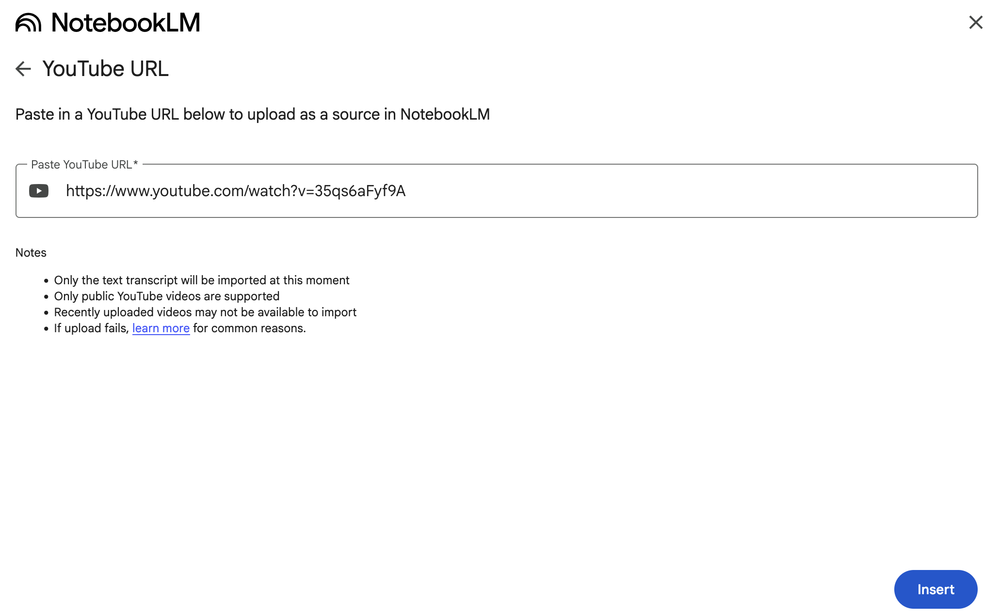

======================================================================
NotebookLMにYouTubeのアニメを入れるのは、いいぞ
======================================================================

:Event: アニメから得た学びを発表会 LT
:Presented: 2025/05/16 nikkie

お前、誰よ
======================================================================

* nikkie（にっきー）
* Pythonとアニメが好き
* 4月から **毎週OSSリリース** 始めました（1つ1つは小さいです）

すぐアイマスに影響されます
--------------------------------------------------

.. raw:: html

    <iframe width="560" height="315" src="https://www.youtube-nocookie.com/embed/KIAdnAEBdJY?si=oaD6kex0jf2Jds1a" title="YouTube video player" frameborder="0" allow="accelerometer; autoplay; clipboard-write; encrypted-media; gyroscope; picture-in-picture; web-share" referrerpolicy="strict-origin-when-cross-origin" allowfullscreen></iframe>

.. https://news.yahoo.co.jp/expert/articles/9b0dae426ca20775288c251fe762d14cb276cfb3

ルビィちゃん！
--------------------------------------------------

は～い

何が好き？
--------------------------------------------------

.. raw:: html

    <iframe width="560" height="315" src="https://www.youtube-nocookie.com/embed/Nz5W0bBVv8c?si=qnOKBOJvrHZ7SZBq" title="YouTube video player" frameborder="0" allow="accelerometer; autoplay; clipboard-write; encrypted-media; gyroscope; picture-in-picture; web-share" referrerpolicy="strict-origin-when-cross-origin" allowfullscreen></iframe>

**板チョコアイス**
--------------------------------------------------

* 森永製菓の板チョコアイスを差し入れ（予定）
* 私はレシートが手に入ってウハウハ
* https://www.morinaga.co.jp/itachoco/idolmaster2025/

本編：みんな〜 **NotebookLM** 使ってる〜？
--------------------------------------------------

NotebookLM
======================================================================

* IMO: **人類史上最高** の発明
* 2023年のGoogle I/Oで発表（`ブログ <https://blog.google/technology/ai/notebooklm-google-ai/>`__）

     a new kind of notebook designed to help people learn faster.

無料で使える AI notebook
--------------------------------------------------

* GoogleのLLM Geminiが裏にいる
* 読みたい文献を指定（URL指定、ファイルアップロード）
* **Geminiに質問しながら** 読み進められる！

.. 有料差別化機能ってある？

DeNA南場さん「**ぶっこむ**」
--------------------------------------------------

.. raw:: html

    <iframe width="560" height="315" src="https://www.youtube-nocookie.com/embed/1veMnZUsn4I?si=ZSUPZJhjgpznlNV1&amp;start=111" title="YouTube video player" frameborder="0" allow="accelerometer; autoplay; clipboard-write; encrypted-media; gyroscope; picture-in-picture; web-share" referrerpolicy="strict-origin-when-cross-origin" allowfullscreen></iframe>

`全文書き起こし <https://fullswing.dena.com/archives/100153/>`__

ぶっこむ
--------------------------------------------------

    | Perplexityで「その方についての必読記事はなんですか」と言ってですね
    | それでそこのURLを全てNotebookLMにぶっこむと (1:57~)

**技術文書** をぶっこむと捗るぞ
--------------------------------------------------

* 拙ブログ `NotebookLMを使うことで、硬めの一次情報ドキュメントに挑むの、すっごく楽になりそう <https://nikkie-ftnext.hatenablog.com/entry/google-notebooklm-is-awesome-for-me-reading-pep>`__
* vさん `ドキュメントに質問して改善していく <https://voluntas.ghost.io/improve-document-by-asking-questions/>`__

質問以外にも便利な機能
--------------------------------------------------

* `マインドマップ <https://support.google.com/notebooklm/answer/16070070?hl=ja>`__
* `Audio Overviews <https://support.google.com/notebooklm/answer/15731776?hl=ja>`__ （**音声概要**）
* `Discover Sources <https://support.google.com/notebooklm/answer/16130650?hl=ja>`__ （文献を検索しに行ける）

音声概要は **日本語** もサポート！
--------------------------------------------------

* 2025/04/29 `NotebookLM Audio Overviews are now available in over 50 languages <https://blog.google/technology/google-labs/notebooklm-audio-overviews-50-languages/>`__
* 男女2人の話者によるPodcast（5〜9分）
* プロンプトでカスタマイズできるらしい（未検証）

💡 **YouTubeのアニメ** もぶっこむ！
--------------------------------------------------

* Geminiと一緒にアニメを見る！
* ⚠️Geminiは画を見ていません。 **音声書き起こしのみ** です

    Only the text transcript will be imported at this moment

今回のアニメ：青春ブタ野郎
======================================================================

* https://ao-buta.com/
* 電撃文庫原作、2018年アニメ化
* じきにミニスカサンタが来ます

思春期症候群
--------------------------------------------------

* 主人公 梓川咲太 高校2年生
* 思春期特有の不安定な精神状態によって引き起こされる現象数々
* https://ao-buta.com/tv/introduction/

おるすばん妹 篇
--------------------------------------------------

* TVアニメ11話「`かえでクエスト <https://ao-buta.com/tv/story/11.html>`__」〜
* 咲太の妹 かえで のお話（`原作 <https://dengekibunko.jp/product/aobuta/321505000278.html>`__）
* 「*おうち大好き*」の裏にあった思春期症候群。涙なしには見られない😭😭😭

凝縮された総集編
--------------------------------------------------

.. raw:: html

    <iframe width="560" height="315" src="https://www.youtube-nocookie.com/embed/35qs6aFyf9A?si=G8MxxjSYhhxZGdWC" title="YouTube video player" frameborder="0" allow="accelerometer; autoplay; clipboard-write; encrypted-media; gyroscope; picture-in-picture; web-share" referrerpolicy="strict-origin-when-cross-origin" allowfullscreen></iframe>

おるすばん妹総集編をぶっこむ！
--------------------------------------------------

Podcastで語られた おるすばん妹
--------------------------------------------------

* 感じた **せつなさが言語化** された！！
* セリフの文字起こししかないはずなのにすごい
* ハルシネーションもあります（Not for me な方もいそう）

*喪失と再生* ：逆説
--------------------------------------------------

（内容に踏み込むので懇親会で！）

まとめ🌯：NotebookLMにYouTubeのアニメを入れるのは、いいぞ
======================================================================

* 青ブタ おるすばん妹 総集編をPodcastにしたら、感動が深まった
* 技術文書もYouTubeもガンガンぶっこもう！
* **AIと一緒にアニメを見た** と言えるのでは

ご清聴ありがとうございました
--------------------------------------------------

現在 `再放送 <https://ao-buta.com/tv/onair/>`__ してます！
