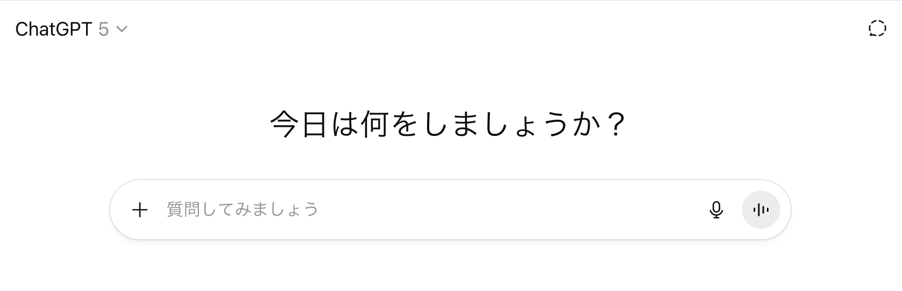
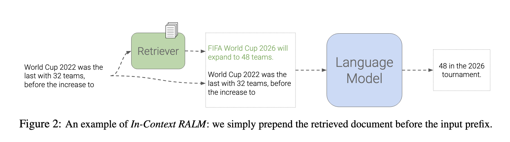
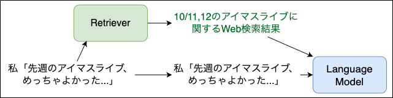

======================================================================
ターミナルからLLMを！ simonw/llm の布教
======================================================================

:Event: 神楽坂第1ターミナル
:Presented: 2025/10/20 nikkie

お前、誰よ？
======================================================================

* nikkie（にっきー）・Python使い（`ポジションペーパー <https://docs.google.com/presentation/d/1XTpSIbPFdUWu_I4uKZtQFWy7bWw9ljUFhhnefUsgBS0/edit?slide=id.g38c054c9981_0_0#slide=id.g38c054c9981_0_0>`__）
* :fab:`github` @ftnext 私が欲しい小さなライブラリをおすそ分けでOSS（hayasaka, flake8-kotoha）
* 機械学習エンジニア。 `Speeda AI Agent <https://www.uzabase.com/jp/info/20250901/>`__ 開発（`We're hiring! <https://hrmos.co/pages/uzabase/jobs/1829077236709650481>`__）

.. image:: ../_static/uzabase-white-logo.png

好きなCLIツールを布教するぜ！
------------------------------------------------------------

* 「お勧めコマンドラインツール」を聞きたい人もいる！
* ref: `Magnoliaさんのツイート「ターミナルナイト、どんなことが聞きたい？」 <https://x.com/magnolia_k_/status/1968689078792016191>`__
* **ターミナルからLLMを使う** という話です

LLM、使っていますか？🙋
======================================================================

* OpenAI `GPT <https://chatgpt.com/ja-JP/overview>`__
* Anthropic `Claude <https://www.claude.com/product/overview>`__
* Google `Gemini <https://deepmind.google/models/gemini/>`__
* etc. etc.

ブラウザでChatGPT (GPT-5)
---------------------------------------------------

エディタで GitHub Copilot
---------------------------------------------------

.. image:: ../_static/kagurazaka-terminal/github-copilot-agent.png
    :scale: 60%

私は思った「**ターミナルでも** LLMを使いたい！」
------------------------------------------------------------

※今年（2025年）の3月終わり頃の話です

推しの simonw/llm
======================================================================

Python🐍製CLIツール

Simon Willisonさん
---------------------------------------------------

* `Django <https://www.djangoproject.com/>`__ （PythonのWebアプリフレームワーク）のCo-creator
* https://simonwillison.net/ でここ数年 **LLMについて精力的に発信** （自転車に乗るペリカン）
* （勝手に） *我がヨーダ*

simonw/llm
---------------------------------------------------

    CLI utility and Python library for interacting with Large Language Models from organizations like OpenAI, Anthropic and Gemini plus (略)

* https://pypi.org/project/llm/ (2023年4月〜)
* https://github.com/simonw/llm

simonw/llm動作例
---------------------------------------------------

.. code-block:: bash

    $ uvx llm models
    Default: gpt-4o-mini

.. code-block:: bash

    $ # OPENAI_API_KEY
    $ uvx llm "Ten fun names for a pet pelican"

補足：Python環境は :command:`uv` だけあればいい
---------------------------------------------------

* `Astral社のuv <https://github.com/astral-sh/uv>`__ 登場でPython環境が *簡単* に
* （``uv`` の他に） `uvxコマンド <https://docs.astral.sh/uv/guides/tools/>`__ も生える
* ``uvx llm`` は最新の ``llm`` を一時的な *仮想環境* にインストールして実行

.. 他に pipx run

プラグインでサポートするモデルを拡張
======================================================================

.. code-block:: bash

    $ uvx --with llm-gemini llm models
    GeminiPro: gemini/gemini-2.5-flash (aliases: gemini-2.5-flash)
    GeminiPro: gemini/gemini-2.5-pro (aliases: gemini-2.5-pro)

.. code-block:: bash

    $ # LLM_GEMINI_KEY
    $ uvx --with llm-gemini \
        llm -m gemini-2.5-flash 'Tell me fun facts about Mountain View'

推し1️⃣ Unixコマンドと **パイプ** で繋げられる！
---------------------------------------------------

.. code-block:: bash

    $ cat index.ts | uvx --with llm-gemini \
        llm -m gemini-2.0-flash 'TypeScriptの内容を解説してください。'

.. https://nikkie-ftnext.hatenablog.com/entry/simonw-llm-and-plugins-are-awesome

.. code-block:: bash

    % curl <URL> | uvx markitdown \
        | uvx --with llm-gemini \
        llm -m gemini-2.0-flash 'マークダウンはそのままに、日本語に翻訳してください' > translated.md

推し2️⃣ 自動ロギング
---------------------------------------------------

* `Logging to SQLite <https://llm.datasette.io/en/stable/logging.html>`__

.. code-block:: bash
    :caption: ログの最新1件をJSON形式で出力

    $ uvx llm logs -n1 --json

.. 拙ブログ `simonwさんのllmは天才！ LLM APIへの入出力が全部ロギングされてました <https://nikkie-ftnext.hatenablog.com/entry/2025/04/11/224643>`__）

推し3️⃣ プラグインで拡張
---------------------------------------------------

* `Developing a model plugin <https://llm.datasette.io/en/stable/plugins/tutorial-model-plugin.html>`__
* https://github.com/ftnext/llm-devin

.. code-block:: bash

    $ uvx --with llm-devin llm models
    DevinModel: devin
    DeepWikiModel: deepwiki

.. LT `コマンドラインからDevinを呼び出してみないか？ <https://ftnext.github.io/2025-slides/aid-devin2/llm-devin.html>`__

コーディングエージェント **CLI** の台頭
======================================================================

* `Claude Code <https://www.claude.com/product/claude-code>`__
* `Gemini CLI <https://geminicli.com/>`__
* `Codex CLI <https://developers.openai.com/codex/cli/>`__
* etc. etc.

「simonw/llmの代わりにClaude Codeでよくない？」
---------------------------------------------------

🥹 🥹 🥹

Unixコマンドとパイプで繋げられる🙆‍♂️
---------------------------------------------------

.. code-block:: bash
    :caption: `CLI commands (Claude Code) <https://docs.claude.com/en/docs/claude-code/cli-reference#cli-commands>`__

    $ cat logs.txt | claude -p "explain"

.. code-block:: bash
    :caption: `Scripting Claude <https://nikkie-ftnext.hatenablog.com/entry/anthropic-code-with-claude-archive-mastering-claude-code-in-30-minutes-amazing-part2#Scripting-Claude>`__ （動画「`Mastering Claude Code in 30 minutes <https://www.youtube.com/watch?v=6eBSHbLKuN0>`__」）

    $ git status | \
        claude -p "what are my changes?" --output-format=json | \
        jq '.result'

自動ロギング🙆‍♂️
---------------------------------------------------

:直前の会話の続きから再開: :command:`claude --resume`
:これまでの会話履歴から選んで再開: :command:`claude --continue`

`CLI flags <https://docs.claude.com/en/docs/claude-code/cli-reference#cli-flags>`__

.. https://nikkie-ftnext.hatenablog.com/entry/claude-code-tips-print-then-continue-or-resume

プラグインで **拡張** 🤔
---------------------------------------------------

llm-devin 爆誕と等価ではないかもしれないですが

* `Gemini CLI Extensions <https://geminicli.com/extensions/>`__
* Claude Code `Plugins <https://docs.claude.com/en/docs/claude-code/plugins>`__

simonw/llmだけにできることは...？
---------------------------------------------------

実際私もClaude Code -> Codex CLIと変遷しています（テノヒラクルクルー👋）

💡simonw/llmは **RAG** ができます！
======================================================================

RAG: Retrieval-Augmented Generation
---------------------------------------------------

* LLMはある時点までの知識しかない（*カットオフ*）
* 例えば、最新の話題（`先週のアイドルマスターのライブ <https://idolmaster-official.jp/live_event/million12th/>`__）には正確に回答できない
* 解決するために、RAG（検索拡張生成）

LLMのコンテキストに外部情報を追加
---------------------------------------------------

論文「`In-Context Retrieval-Augmented Language Models <https://arxiv.org/abs/2302.00083>`__」Figure 2

.. revealjs-break::

* LLMはライブをもちろん知らないが、質問と合わせて例えば **Web検索結果も与えられれば** 回答できる

.. `担当の主演公演を観て <https://note.com/gold_fish5029/n/n4501462d643a>`__

simonw/llmでRAG
======================================================================

.. https://nikkie-ftnext.hatenablog.com/entry/simonw-llm-support-text-embedding-cosine-similarity

* `劇場版アイドルマスター <https://www.idolmaster-anime.jp/>`__ についてLLMとおしゃべりします
* 「**もう時間がないんですか**」
* 劇中に「もう時間がないんです！」が登場するので、それを踏まえて回答してほしい

simonw/llmはembeddingを計算できる！
---------------------------------------------------

* `Embedding with the CLI <https://llm.datasette.io/en/stable/embeddings/cli.html>`__
* テキストを意味を保った **ベクトル** （embedding）に変換
* 似た意味のテキストはembeddingのコサイン類似度が1に近い

embeddingを保存
---------------------------------------------------

.. code-block:: bash

    $ uvx llm embed-multi oai-movimas movimas.jsonl \
        -m text-embedding-3-small --format nl --store
    $ uvx llm collections list
    oai-movimas: text-embedding-3-small
      1207 embeddings

`劇場版のセリフ <https://github.com/erutaso/THE-IDOL-MASTER-MOVIE>`__ を公開している方がいます

コサイン類似度で検索（＝意味検索）
---------------------------------------------------

.. code-block:: bash

    $ # OPENAI_API_KEY
    $ uvx llm similar oai-movimas -c 'もう時間がないんですか' -n 4 | jq -c '.'
    {"id":"1045","score":0.4650222891995457,"content":"志保「もう時間が無いんです！　今進める人間だけでも進まないと、みんなダメになりますよ！？」","metadata":null}
    {"id":"954","score":0.42914991489215454,"content":"P「今からやれば十分間に合うわけだし、そう重く受け止めなくてもいいんじゃないか？」","metadata":null}
    {"id":"1072","score":0.418144028938804,"content":"P「だから、もう少しみんなに負担がない時期とか、やりようはあるとおも…」","metadata":null}
    {"id":"1192","score":0.41312547632270286,"content":"千早「まだ…見つかってないわ」","metadata":null}

「もう時間がないんですか」💯
---------------------------------------------------

.. code-block:: bash

    $ echo "Use the following pieces of context to answer the user's question.
    If you don't know the answer, just say that you don't know, don't try to make up an answer.
    ----------------
    $(uvx llm similar oai-movimas -c 'もう時間がないんですか' -n 4 | jq -r '.content')
    ----------------
    Question: もう時間がないんですか" | uvx llm -
    はい、志保が「もう時間が無いんです！」と言っていますので、時間がない状況であることは確かです。

まとめ🌯 ターミナルからLLMを！ simonw/llm の布教
======================================================================

* パイプで繋げる！ 自動ロギング！ プラグインで拡張！
* しかし、昨今Claude CodeなどのCLIツールでもこれら機能は提供される
* **ナイーブなRAGができる** という独自価値を今回明らかにした（:command:`llm embed-multi`・:command:`llm similar`）

ご清聴ありがとうございました
--------------------------------------------------

Simon Willisonさん、素晴らしいツールをありがとう🫶
