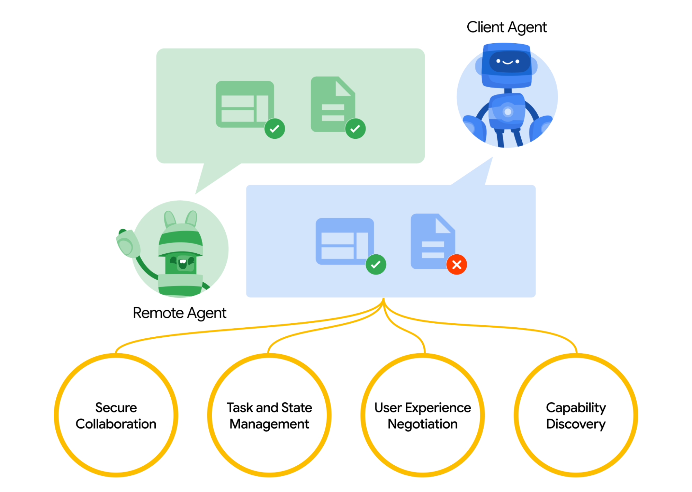
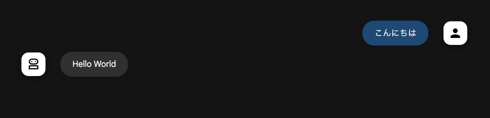
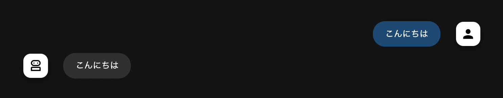

:ogp_title: Pythonで Agent2Agent Protocol
:ogp_event_name: stapy-lt
:ogp_slide_name: july-agent2agent
:ogp_description: みんなのPython勉強会#116
:ogp_image_name: stapy-lt-july

======================================================================
Pythonで Agent2Agent Protocol
======================================================================

:Event: みんなのPython勉強会#116
:Presented: 2025/07/17 nikkie

AI Agent **どうし** の話
======================================================================

    (略) Agentic AI systems represent a paradigmatic shift marked by multi-agent collaboration, (略)

論文「`AI Agents vs. Agentic AI: A Conceptual Taxonomy, Applications and Challenges <https://arxiv.org/abs/2505.10468>`__」によれば、単体のエージェントをAgentic AIとは呼びません

.. _Announcing the Agent2Agent Protocol (A2A): https://developers.googleblog.com/en/a2a-a-new-era-of-agent-interoperability/

A2A、ご存知ですか？🙋
------------------------------------------------------------

* この **4月** のGoogle Cloud Next ‘25で発表
* `Announcing the Agent2Agent Protocol (A2A)`_
* 🏃‍♂️6月 `Google Cloud donates A2A to Linux Foundation <https://developers.googleblog.com/en/google-cloud-donates-a2a-to-linux-foundation/>`__

.. https://cloud.google.com/blog/products/ai-machine-learning/build-and-manage-multi-system-agents-with-vertex-ai

.. _A2Aのページ: https://a2aproject.github.io/A2A/latest/

`A2Aのページ`_ より
------------------------------------------------------------

    Build with ADK (or any framework), equip with MCP (or any tool), and communicate with A2A, to remote agents, local agents, and humans.

A2Aのコンセプト
------------------------------------------------------------

* フレームワーク（`ADK <https://google.github.io/adk-docs/>`__ など）を使って、エージェントを構築
* エージェントに **ツール** を持たせる（MCP）
* A2Aでリモートエージェント、ローカルエージェント、 *人類* が **やりとり**

**リモート** エージェントと **ローカル** エージェント
======================================================================

`Announcing the Agent2Agent Protocol (A2A)`_ より引用

サーバとクライアント
------------------------------------------------------------

:リモートエージェント: A2Aサーバ
:ローカルエージェント: A2Aクライアント

**HTTP** でやり取り

A2Aサーバの実装
------------------------------------------------------------

* `GET /.well-known/agent.json`

    * `Agent Card <https://a2aproject.github.io/A2A/latest/specification/#5-agent-discovery-the-agent-card>`__ 公開

* `POST /` （※Agent Cardに記載）

    * JSON RPCでクライアントから呼び出す

:file:`agent.json` （抜粋）
------------------------------------------------------------

.. code-block:: json

    {
      "name": "Hello World Agent",
      "description": "Just a hello world agent",
      "url": "http://localhost:9999/",
      "skills": [
        {
          "description": "just returns hello world",
          "examples": [
            "hi",
            "hello world"
          ],
          "id": "hello_world",
          "name": "Returns hello world",
          "tags": [
            "hello world"
          ]
        }
      ]
    }

JSON RPC
------------------------------------------------------------

.. code-block:: bash

    % curl http://0.0.0.0:9999/ --json '{"id": 1, "jsonrpc": "2.0", "method": "message/send", "params": {"message": {"role": "user", "parts": [{"kind": "text", "text": "Hi"}], "messageId": "abc"}}}'
    {"id":1,"jsonrpc":"2.0","result":{"kind":"message","messageId":"13c44c32-1fcf-4d27-a3c5-d5fd46583390","parts":[{"kind":"text","text":"Hello World"}],"role":"agent"}}

a2a-sdk
======================================================================

* https://pypi.org/project/a2a-sdk/
* PythonでA2Aサーバ・クライアントの実装例（フレームワーク非依存）
* Hello World サンプル：https://github.com/a2aproject/a2a-samples/tree/main/samples/python/agents/helloworld

Hello World エージェントとA2A
------------------------------------------------------------

* リモート：Hello World （a2a-sdk実装）
* ローカル：*人* （ADKでつなぎこみ）

ADK: Agent Development Kit
------------------------------------------------------------

    Add A2A support as experimental features (`1.6.1 <https://github.com/google/adk-python/releases/tag/v1.6.1>`__)

.. code-block:: python

    root_agent = RemoteA2aAgent(
        name="Hello_World_Agent",
        agent_card="http://0.0.0.0:9999/.well-known/agent.json",
    )

デモ：ローカル（人）からリモートにメッセージを送信
------------------------------------------------------------

.. revealjs-break::

:A2Aサーバ: :command:`uv run .` (`a2a-samples の Hello World <https://github.com/a2aproject/a2a-samples/tree/72e5fff85524e8af1f44cbf1c87b9a2424a7c3da/samples/python/agents/helloworld>`__)
:A2Aクライアント: :command:`uvx --from 'google-adk[a2a]' adk web` (`call_from_adk <https://github.com/ftnext/a2a-practice/tree/d73447b8b5fad7194596bf3c0f02d42dc33ca7f2/a2a-samples/helloworld/call_from_adk>`__ agent)

.. revealjs-break::

* 今回はメッセージに絞ってますが、*タスク* という概念があります（時間のかかる処理らしい）
* 積ん読リストより `AI エージェントの連携を標準化する A2A プロトコルを試してみる <https://azukiazusa.dev/blog/ai-a2a-protocol/>`__

**プロトコル** ということは
======================================================================

* フレームワークによらない
* プログラミング言語によらない（Python以外）

a2a-sdkを使わない例
------------------------------------------------------------

* リモート：オウム返し（**FastAPI** 実装）
* ローカル：人（ADKでつなぎこみ）

A2Aに則るので、メッセージをやり取りできます！
------------------------------------------------------------

.. code-block:: bash

    % curl http://0.0.0.0:9999/ --json '{"id": 1, "jsonrpc": "2.0", "method": "message/send", "params": {"message": {"role": "user", "parts": [{"kind": "text", "text": "Hi"}], "messageId": "abc"}}}'
    {"id":1,"jsonrpc":"2.0","result":{"kind":"message","messageId":"4d1dfebee3af46c8b2c726074de3b536","parts":[{"kind":"text","text":"Hi"}],"role":"agent"}}

デモ：a2a-sdkを使わない例
------------------------------------------------------------

.. revealjs-break::

:A2Aサーバ: uv run `minimum_server.py <https://github.com/ftnext/a2a-practice/blob/d73447b8b5fad7194596bf3c0f02d42dc33ca7f2/a2a-samples/helloworld/minimum_server.py>`__
:A2Aクライアント: :command:`uvx --from 'google-adk[a2a]' adk web` (`call_from_adk <https://github.com/ftnext/a2a-practice/tree/d73447b8b5fad7194596bf3c0f02d42dc33ca7f2/a2a-samples/helloworld/call_from_adk>`__)（再掲）

まとめ🌯：Pythonで Agent2Agent Protocol
======================================================================

* A2Aは **リモートエージェント** と **ローカルエージェント** のやり取りのためのプロトコル
* Pythonには a2a-sdk がある
* ADKなどフレームワークでもサポートが進む（`PydanticAI <https://ai.pydantic.dev/a2a/>`__）

以上、nikkie（にっきー）でした！
======================================================================

* 機械学習エンジニア・`Speeda AI Agent <https://www.uzabase.com/jp/info/20250630/>`__ 開発（`We're hiring! <https://hrmos.co/pages/uzabase/jobs/1829077236709650481>`__）
* みんなのPython勉強会 スタッフ・4代目LT王子

.. image:: ../_static/uzabase-white-logo.png

Thank you for your attention!

Appendix（拙ブログ記事）
======================================================================

* `a2a-samplesのPython Hello World Exampleを動かす <https://nikkie-ftnext.hatenablog.com/entry/agent2agent-protocol-sample-hello-world-python-server-and-client>`__
* `Hello World Example相当のA2AサーバをFastAPIで再現する <https://nikkie-ftnext.hatenablog.com/entry/a2a-hello-world-sample-try-compatible-fastapi-implementation>`__
* `Agent Development Kit 1.6.1 でA2Aが実験的にサポートされました！その中の RemoteA2AAgent を触る <https://nikkie-ftnext.hatenablog.com/entry/google-adk-161-experimental-a2a-support-remotea2aagent-practice>`__
