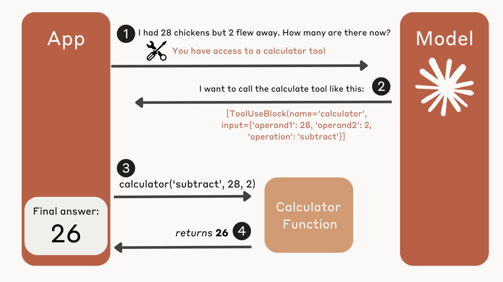

================================================================================
クイズ！ GPT・Claude・Geminiのうち、Web検索が一番うまいのはどのモデルでしょう？
================================================================================

前準備メモ
--------------------------------------------------

* ``docker`` 起動
* ``uvx mcp-server-fetch`` は1回やっておく（ハング対策）

クイズ！ GPT・Claude・Geminiのうち、Web検索が一番うまいのはどのモデルでしょう？
================================================================================

:Event: みんなのPython勉強会#113
:Presented: 2025/03/27 nikkie

LLM入場
======================================================================

* GPT
* Claude
* Gemini

GPT
--------------------------------------------------

* OpenAIが提供する `LLMのシリーズ <https://platform.openai.com/docs/models>`__
* 直近では `4oが画像生成できるようになった <https://openai.com/index/introducing-4o-image-generation/>`__
* 今回使うのは **gpt-4o** （有料）

Claude
--------------------------------------------------

* Anthropicが提供する `LLMのシリーズ <https://www.anthropic.com/claude>`__
* 最新は `Claude 3.7 Sonnet <https://www.anthropic.com/news/claude-3-7-sonnet>`__
* 今回使うのは **claude-3-5-sonnet-latest** （有料）

Gemini
--------------------------------------------------

* Googleが提供する `LLMのシリーズ <https://ai.google.dev/gemini-api/docs/models?hl=ja>`__
* 最新は `Gemini 2.5 Pro <https://blog.google/technology/google-deepmind/gemini-model-thinking-updates-march-2025/>`__
* 今回使うのは **gemini-2.0-flash** （無料だが、訓練データになる。OpenAI API互換でも使える）

LLMがWeb検索？
======================================================================

「チャットできるだけですよね？」

人類はLLMを拡張したい（Augmented）
--------------------------------------------------

* 知っている知識は訓練時点までに限定される（カットオフ）
* 文章の続きを作るだけなので、計算機のような正確な計算はできない

🏃‍♂️2024年話題になっていた *RAG* は拡張の1つ。参照する文書を追加する

**Tool use** による拡張
--------------------------------------------------

`Anthropic提供のCourse <https://github.com/anthropics/courses/blob/b4f26aedef55e06ad5eead5de83985249d1fab2f/tool_use/02_your_first_simple_tool.ipynb>`__ より

**Tool use** による拡張
--------------------------------------------------

* LLMに「こんなToolも使えるよ」と示す
* LLMはToolを使うかを判定し、使うときは **Toolを使っているテキストを出力**
* Toolを実行するのは、私たちのプログラム

いまホットな例：MCP
--------------------------------------------------

* `Model Context Protocol <https://modelcontextprotocol.io/introduction>`__
* `Anthropicが提案 <https://www.anthropic.com/news/model-context-protocol>`__ (2024/11)
* 2025/03時点で、ほとんどデファクトスタンダード（無視できない）

MCP
--------------------------------------------------

* サーバとクライアント
* クライアントの例：Claude Desktop、Cursorなどなど。今回 `自作 <https://github.com/ftnext/mcp-practice/tree/dc7017fe59ef22bd3ab26cf718a1e8f121aa4ba3/deep-research>`__
* TypeScript・Python・Go・Rustで多様なサーバが日々増えてます！

デモ！！
======================================================================

* 使えるツール： **Brave Search（検索）** 、Webページ取得
* 「PyCon JP 2025のテーマやコンセプトについて調査してください」

gemini-2.0-flash
--------------------------------------------------

検索の様子 https://gist.github.com/ftnext/cf974195c3d8257ee73d0724eaf8033c

.. code-block:: markdown

    PyCon JP 2025は、2025年9月26-27日に広島国際会議場で開催される予定です。現在、主催メンバーが中心となって、全体的なコンセプトとテーマを決定するための作業が進められています。具体的なテーマやコンセプトはまだ発表されていません。

gpt-4o
--------------------------------------------------

検索の様子 https://gist.github.com/ftnext/43685381d8ac331f9216e141b5f0710c

.. code-block:: markdown

    PyCon JP 2025 is scheduled to take place on September 26-27, 2025, at the International Conference Center Hiroshima. The event is organized by volunteers, and they are currently preparing for ticket sales, speaker recruitment, and sponsorship opportunities. However, specific details about the theme or concept for PyCon JP 2025 have not been disclosed yet. For the latest updates, you might want to keep an eye on their [official website](https://2025.pycon.jp/).

claude-3-5-sonnet-latest
--------------------------------------------------

検索の様子 https://gist.github.com/ftnext/113e8e6a7077b14adb7558004b3fbf17

.. code-block:: markdown

    公式サイトを確認しましたが、現時点ではまだテーマやコンセプトは公開されていないことが確認できました。サイトは基本的な開催情報（日時・場所）のみが掲載されており、現在も準備段階であることが分かります。

    まとめると：
    - PyCon JP 2025は広島で初めて開催される大規模なPythonカンファレンスです
    - 開催日時と場所は決定していますが、テーマやコンセプトについては現在も運営チームによって検討が進められている段階です
    - 正式なテーマやコンセプトは、今後の運営チームのミーティングを経て発表される予定です

    テーマやコンセプトについての最新情報は、PyCon JP 2025の公式サイト（https://2025.pycon.jp/）や公式SNSアカウントで随時発表されると思われます。

実は **座長日報** があります
--------------------------------------------------

`PyCon JP 2025 のコンセプト <https://pyconjp-2025-chair.nishimotz.com/2025/01/21/concepts-for-pycon-jp.html>`__

    | これはまだ正式なメッセージではありませんが、 3.14 からの連想で、コンセプトの言語化を試みたので、ご紹介します。
    | 「Python の輪、広島から広がる」

所感
======================================================================

* ClaudeだけTool use **別格** では？
* OpenAI API互換エンドポイント利用でGeminiには不利だったかも
* openai-agents SDKやgoogle-genai SDKを組み込んで、よりフェアな評価が残る

IMO：Anthropic、したたかすぎでは？
--------------------------------------------------

* プロトコルって人畜無害な顔して展開（言語非依存なのでハッカーが集った）
* Tool useが現在一番うまいのはClaude
* **MCPが広がるほど、Claudeが輝く** 名プロデュース

以上、nikkie（にっきー）でした！
======================================================================

* みんなのPython勉強会 スタッフ・4代目LT王子
* 機械学習エンジニア・LLM・自然言語処理（`We're hiring! <https://hrmos.co/pages/uzabase/jobs/1829077236709650481>`__）
* `ブログ <https://nikkie-ftnext.hatenablog.com/>`__ 連続 **860** 日突破

.. image:: ../_static/uzabase-white-logo.png

Appendix：ブログ版
--------------------------------------------------

`GPT・Claude・Geminiのうち、Brave Search toolの使い方が一番うまいのは誰でしょう？クイズ〜〜！！ <https://nikkie-ftnext.hatenablog.com/entry/comparison-llms-with-mcp-servers-brave-search-and-fetch>`__
