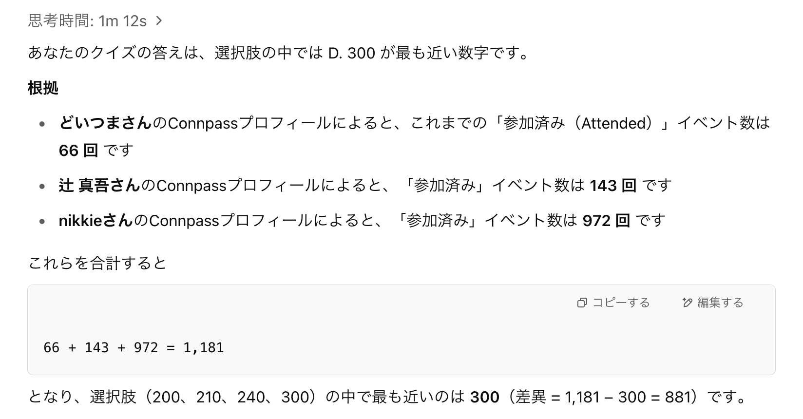

.. raw:: html

    

================================================================================
クイズでお祝い！ みんなのPython勉強会10周年
================================================================================

:Event: みんなのPython勉強会#114
:Presented: 2025/05/30 nikkie

クイズの時間だあああああああああ
================================================================================

* 皆さまいつもご参加ありがとうございます！
* **参加型のstapyクイズ** を実施します

    参加者数の推移や反響が大きかった発表などから出題します。(connpass参照)

出題者、誰よ？
================================================================================

* nikkie（にっきー） ／ みんなのPython勉強会 **スタッフ**
* 機械学習エンジニア・LLM・自然言語処理（`We're hiring! <https://hrmos.co/pages/uzabase/jobs/1829077236709650481>`__）
* `ブログ <https://nikkie-ftnext.hatenablog.com/>`__ 連続 920日突破

私とstapy
---------------------------------------------------

* 初参加は **2018年1月** `みんなのPython勉強会#31 <https://startpython.connpass.com/event/73165/>`__

    * そのときの `レポートブログ <https://nikkie-ftnext.hatenablog.com/entry/2018/01/11/001445>`__

* その年の `9月（#38） <https://startpython.connpass.com/event/92358/>`__ で4代目LT王子🤴襲名

4択クイズです！
================================================================================

鉛筆コロコロ🎲Pythonスクリプトも用意しました

:fab:`github` `quiz/app.py <https://github.com/ftnext/2025-slides/blob/main/samplecode/quiz/app.py>`__

本トークわずかのPython要素
---------------------------------------------------

.. literalinclude:: ../../samplecode/quiz/app.py
    :language: python
    :lines: 1-6
    :caption: quiz/app.py

Inline script metadata (PEP 723)
---------------------------------------------------

* :command:`uv run app.py` や :command:`pipx run app.py`
* Pythonスクリプトに必要な仮想環境をツールにおまかせできるんです！（`PyCon JP 2024 <https://2024.pycon.jp/ja/talk/89F3RQ>`__ で話しました）
* 10年前と比べて **超便利** になってます。全人類使ってくれ〜📣

手元で鉛筆転がしたい方へ
---------------------------------------------------

.. code-block:: bash

    uv run https://raw.githubusercontent.com/ftnext/2025-slides/refs/heads/main/samplecode/quiz/app.py

.. code-block:: bash

    pipx run https://raw.githubusercontent.com/ftnext/2025-slides/refs/heads/main/samplecode/quiz/app.py    

それではクイズを始めます！
================================================================================

* 4択クイズ 全8問です。**お手元で計数** ください🙏
* Zoomのチャット欄やTwitter #stapy への投稿もよければどうぞ
* 現地参加者限定で成績上位者にPython書籍プレゼント！

AIを使っても大丈夫です
---------------------------------------------------

* GPT + Web search / Claude + Web search

第1問
---------------------------------------------------

いま何回目？
================================================================================

いま何回目？
---------------------------------------------------

A. 114
B. 116
C. 118
D. 120

正解は **A. 114**
---------------------------------------------------

https://startpython.connpass.com/event/353837/

o4-mini + Web searchさん 🙆‍♂️
---------------------------------------------------

第2問
---------------------------------------------------

これまでのみんなのPython勉強会で、**2回開催** したナンバリングはどれ？
================================================================================

2回開催したナンバリングはどれ？
---------------------------------------------------

A. 33回目
B. 38回目
C. 43回目
D. 2回開催したことはない

o4-mini「D. 2回開催したことはない」、さて
---------------------------------------------------

ヒントは時期
---------------------------------------------------

A. 33回目（春）
B. 38回目（夏）
C. 43回目（春）
D. 2回開催したことはない

正解は **B. 38回目**
---------------------------------------------------

* `2018年8月の #38 <https://startpython.connpass.com/event/92356/>`__ が台風で中止（`サンサン <https://weathernews.jp/onebox/typhoon/2018/13/>`__）
* 翌 `9月に #38 <https://startpython.connpass.com/event/92358/>`__ を別の内容「秋の夜長のショートトーク会」で実施（`アーカイブ <https://www.youtube.com/live/9rAv0ejA9X0?si=Rvms9Qc5NEpXwLew>`__）

第3問
---------------------------------------------------

2025年時点で、参加者最大を記録したのは何年？
================================================================================

参加者最大を記録したのは何年？
---------------------------------------------------

A. 2019年
B. 2020年
C. 2021年
D. 2022年

o4-mini「C. 2021年」
---------------------------------------------------

正解は **B. 2020年**
---------------------------------------------------

* `2020年8月の #60 <https://startpython.connpass.com/event/175455/>`__ にて 595人参加 を記録（`アーカイブ <https://www.youtube.com/live/DVF1q6k4UfE?si=KmonTDcH3LY6K5P_>`__）

    マーケティングとデータアナリティクスとPython

.. revealjs-break::
    :notitle:

コロナ禍で **オンライン開催** に移り、参加者が増えました

第4問
---------------------------------------------------

本日の発表者と司会の参加回数を合計して近い数字は？
================================================================================

* 司会：どいつまさん
* 辻さん
* nikkie

3名の参加回数の合計に近い数字は？
---------------------------------------------------

A. 200
B. 210
C. 240
D. 300

o4-mini「D. 300」
---------------------------------------------------

connpassの *全イベント* 参加回数を集計

正解は **B. 210**
---------------------------------------------------

* https://startpython.connpass.com/participation/ で見られます
* 105 (辻さん) + 83 (nikkie) + 21 (どいつまさん)

第5問
---------------------------------------------------

「みんなのPython勉強会#100」はどの日に開催された？
================================================================================

「みんなのPython勉強会#100」はどの日に開催された？
---------------------------------------------------

A. 2024年1月25日
B. 2024年2月22日
C. 2023年11月15日
D. 2023年10月12日

正解は **A. 2024年1月25日**
---------------------------------------------------

* `2024/01 みんなのPython勉強会#100 <https://startpython.connpass.com/event/304688/>`__ （`アーカイブ <https://youtu.be/B2X6b6NUmU0?si=4QnnnNU7ecezDTZ_>`__）
* 2023年11月が99回、12月にお休みして翌年1月に100回

o4-mini「A. 2024年1月25日」🙆‍♂️
---------------------------------------------------

第6問
---------------------------------------------------

stapy **参加回数** の多い順に並べると？
================================================================================

* 辻さん
* nikkie
* kiotoさん
* soogieさん

参加回数の多い順に並んでいるものは？
---------------------------------------------------

A. 辻さん > kiotoさん > soogieさん > nikkie
B. kiotoさん > soogieさん > 辻さん > nikkie
C. kiotoさん > 辻さん > soogieさん > nikkie
D. nikkie > 辻さん > kiotoさん > soogieさん

発動、50:50
---------------------------------------------------

**A または C** です

:A: 辻さん > kiotoさん > soogieさん > nikkie
:C: kiotoさん > 辻さん > soogieさん > nikkie

正解は **C**
---------------------------------------------------

.. list-table::

    * - 名前
      - `回数 <https://startpython.connpass.com/participation/>`__
    * - kiotoさん
      - 118回
    * - 辻さん
      - 105回
    * - soogieさん
      - 91回
    * - nikkie
      - 83回

参考までに、o4-miniさん「A」
---------------------------------------------------

.. image:: ../_static/stapy-may-10th/o4-mini-web-search-q6.png

kiotoさん
---------------------------------------------------

* いつもご参加ありがとうございます
* `オンラインもくもく会 <https://startpython.connpass.com/event/276540/>`__ （with Uematsuさん）
* `108回「人生100年時代、長く現役で働くには」のトーク <https://youtu.be/a53WdNPQntw?si=Qwz8s7IfKTFf6X2P>`__ 👏

soogieさん
---------------------------------------------------

* いつもご参加ありがとうございます
* `2022年5月 #81 <https://startpython.connpass.com/event/245654/>`__ 『職場にPythonistaを増やすには』👏

第7問
---------------------------------------------------

みんなのPython勉強会で紹介された言語のうち、Pythonに **文法が近い** と紹介されたものは？
==========================================================================================

Pythonに文法が近いと紹介されたものは？
---------------------------------------------------

A. Go
B. JavaScript
C. Rust
D. Nim

o4-mini「D. Nim」
---------------------------------------------------

.. image:: ../_static/stapy-may-10th/o4-mini-web-search-q7.png

正解は **D. Nim**
---------------------------------------------------

* `2022年3月 #79 <https://startpython.connpass.com/event/239619/>`__ 「Diversity & Inclusion of Programming Language」
* medyさんによる「Pythonistaに伝えたいNimの魅力」

第8問
---------------------------------------------------

みんなのPython勉強会が過去に *かけた* ことがあるものはどれ？
================================================================================

過去に *かけた* ことがあるのは？
---------------------------------------------------

A. 命
B. 金
C. 時
D. 推し

o4-mini「C. 時」
---------------------------------------------------

.. image:: ../_static/stapy-may-10th/o4-mini-web-search-q8.png

正解は **D. 推し**
---------------------------------------------------

* `2020年2月 #54 <https://startpython.connpass.com/event/163337/>`__ 推し×IT（`アーカイブ <https://www.youtube.com/live/w7CxVJb0AJo?si=CWciDr1oEZf2r_-N>`__）
* Togetterまとめは1万PVを超える https://posfie.com/@abenben/p/p6nAikd

クイズ終了〜！
================================================================================

おつかれさまでした

o4-miniさん 3/8（第1,5,7問）

初代stapyクイズ王 表彰👏
================================================================================

おめでとうございます！

オフラインで賞品の贈呈

皆さまの声が聞こえてくるようです
================================================================================

* 「出題者の人間性を疑う」（並べ替えとか「かけた」とか）
* 「あの回がクイズに入っていないなんて」
* 「**わたしはこれが神回**」ぜひ教えてください

クイズでお祝い！ みんなのPython勉強会10周年
================================================================================

クイズならびに本勉強会にご参加いただき、ありがとうございました

stapy アーカイブ
---------------------------------------------------

* 最近 `Start Python Club <https://www.youtube.com/@startpythonclub9441/>`__
* 過去 `リーディング・エッジ社 <https://www.youtube.com/@%E3%83%AA%E3%83%BC%E3%83%87%E3%82%A3%E3%83%B3%E3%82%B0%E3%82%A8%E3%83%83%E3%82%B8%E7%A4%BE>`__
